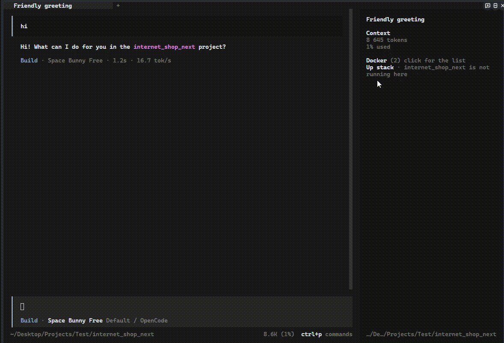

# opencode-docker-panel

[](https://github.com/victor-ochenin/opencodeDockerPlugin/actions/workflows/ci.yml)

A Docker container panel for the OpenCode 2 TUI sidebar.

The panel appends itself to the `sidebar.content` slot, polls `docker ps --all --format "{{json .}}"`, and lets you act on a container from the row itself. Clicking a row opens a dialog with the actions docker accepts for that container's current state; `Down` is the only one that asks for confirmation.

Русская версия этого файла: [README.ru.md](README.ru.md)



## Contents

- [What it does](#what-it-does)
- [Compose stacks](#compose-stacks)
- [Logs](#logs)
- [What it shows](#what-it-shows)
- [Requirements](#requirements)
- [Install](#install)
  - [Option A: let an LLM do it](#option-a-let-an-llm-do-it)
  - [Option B: manual setup](#option-b-manual-setup)
  - [Once the package is on npm](#once-the-package-is-on-npm)
  - [Verification](#verification)
- [Options](#options)
- [Known limits](#known-limits)
- [Changelog](#changelog)
- [License](#license)

## What it does

```text
Docker (2)
• api           0.0.0.0:8080->8080/tcp · shop
1 more, click for all
Up stack · storefront is not running here
```

| Container state | Actions offered |
|---|---|
| `running`, `restarting`, `paused` | `Restart`, `Stop`, and `Down` when the container belongs to a compose project |
| `created`, `exited`, `dead` | `Start`, `Up stack` when the agent directory holds a matching compose file, and `Down` when the container belongs to a compose project |
| anything else | none |

| Action | Command |
|---|---|
| Start | `docker start -- <name>` |
| Up stack | `docker compose -f <file> -p <project> up -d` |
| Restart | `docker restart -- <name>` |
| Stop | `docker stop -- <name>` |
| Down | `docker compose -p <project> down` |

`--` is not optional: a container name may start with a dash, and without the separator docker reads it as a flag. Every option shows its exact command in the dialog footer, so the destructive one is never a surprise.

## Compose stacks

`Up stack` starts a whole compose project instead of one container, using the compose file that sits in the agent directory. That file is executable content: it carries `build`, `command` and `entrypoint`, which is why the dialog shows the exact command before you run it, and why `up` needs no confirmation while `down` does.

The button appears only when the file provably belongs to the project of the container you clicked. The project name is read the way compose v2 reads it: a top-level `name:` if there is one, otherwise the name of the directory holding the file. It must equal the `com.docker.compose.project` label on the container, and the container must not be running already. Anything else and the button is simply absent, because a wrong stack is worse than no button.

A stack that has no containers at all is the normal state of something never started, and it gets its own way in. When the agent directory holds a compose file and no container on the machine carries that project label, the panel adds a line under the rows:

```text
Up stack · storefront is not running here
```

Clicking it asks once, showing the exact command before anything runs, because a compose file is executable content and this stack has no container to name it. The line disappears as soon as one container of that project shows up, because from then on the per-container `Up stack` is the way in. Nothing is offered for a Dockerfile on its own: there is no image name to run, so the panel would be guessing.

The project is passed twice, as `-f <file>` and `-p <project>`. The name inside a compose file can be templated or overridden by the environment, and `-p` makes sure the stack you start is the one the panel was already showing rather than a second copy of it.

Candidate file names are tried in compose's own order: `compose.yaml`, `compose.yml`, `docker-compose.yaml`, `docker-compose.yml`. The first file that exists wins even when it declares another project, because that is the file compose itself would use, so falling through to the next candidate would offer a stack the CLI ignores.

`Down` runs `docker compose down` against the compose project the container carries in its labels, which stops every container of that project and removes their networks. Volumes are kept, and the confirmation dialog says so. A container with no compose project never gets the option, and `buildArgs` refuses it as well.

The result of every action arrives as a toast, and the panel refreshes immediately instead of waiting for the next poll. While a command runs the header shows `working` and further clicks are ignored, so a double click cannot launch two commands.

## Logs

`Logs` in the same menu replaces the dialog contents with a log view for that container, so the log and the actions share one window. It closes with `esc` or by clicking the footer line.

The view is `docker logs --timestamps --tail 200 -- <name>`, refreshed every two seconds while it is open. Docker interleaves the container's two streams, so the two buffers are parsed separately and merged back by timestamp; without that the log reads all of stdout first. ANSI sequences and lone `CR` are stripped, because the terminal would otherwise run them as control codes. A fixed window of fifteen lines is scrolled with the mouse wheel.

## What it shows

The dot is coloured by container state: green for `running`, yellow for `paused` and `restarting`, red for `dead`, muted for everything else. The panel draws running containers and nothing else, at most five rows in the order docker reports them, so the list does not jump between polls. Stopped containers never get a row of their own: the header opens a dialog with every container, and picking one there opens the same actions as a click on its row. A `N more, click for all` line appears under the rows when something is still hidden. With rows to show, the header collapses and expands them instead.

`Pin` in a container's menu keeps that container visible whatever its state, and it spends the five row budget when it happens to run, so pinning everything shows everything. A pin is stored by the host, so it survives a TUI restart and applies to every session; `Unpin` in the same menu drops it. Pinned rows are marked `pinned` next to their ports and project.

| State | Panel output |
|---|---|
| Docker up with containers | `Docker (N)` plus one row per container |
| Docker up, nothing created | `no containers` |
| Docker Desktop not running | `docker desktop not running` |
| Docker not installed | `docker not installed` |
| `docker ps` timed out | last known rows with a `stale` marker |
| No permission on the Docker socket | `no permission to talk to docker` |

A missing or stopped Docker is a normal state, not a plugin failure, so it is reported as a muted line rather than an error. Any failed poll, whether a timeout or a dead daemon, keeps the last known rows with a `stale` marker instead of blanking the panel; a successful poll that reports no containers clears the list.

## Requirements

- OpenCode 2 runtime with plugin slots (`opencode2`)
- `docker` on `PATH`: Docker Desktop on Windows, Docker Engine on Linux and macOS

The panel's own strings are English only; the documentation is bilingual.

## Install

The package is not published on npm yet, so copying the files is the working path today. The `cli.json` entry is required either way.

### Option A: let an LLM do it

Paste this into any agent (Claude Code, OpenCode, Cursor, and so on):

```text
Install the opencode-docker-panel Docker sidebar plugin by following
https://github.com/victor-ochenin/opencodeDockerPlugin#installation
```

### Option B: manual setup

Copy the plugin files into the OpenCode config directory. On Windows that is `%USERPROFILE%\.config\opencode\plugins\docker-panel\`.

```powershell
$src = "path\to\opencodeDockerPlugin"
$dst = "$HOME\.config\opencode\plugins\docker-panel"
New-Item -ItemType Directory -Force -Path $dst | Out-Null
Copy-Item "$src\*.ts","$src\*.tsx","$src\package.json" -Destination $dst -Force
```

Then add it to `~/.config/opencode/cli.json`. Create the file if it does not exist and keep whatever is already in it.

```jsonc
{
  "$schema": "https://opencode.ai/v2/cli.json",
  "plugins": [{ "package": "./plugins/docker-panel", "options": { "intervalMs": 3000 } }]
}
```

Two things trip people up here, so they are worth stating plainly:

- **It goes in `cli.json`, not `opencode.json`.** This is a terminal-only plugin: it draws in the sidebar, and `cli.json` is the file the terminal client reads.
- **There is no login step and no provider to configure.** It talks to the local `docker` CLI and nothing else.

Restart the TUI afterwards.

### Once the package is on npm

After publication the same entry with a package name replaces the path, and there is nothing to copy:

```jsonc
{
  "$schema": "https://opencode.ai/v2/cli.json",
  "plugins": [{ "package": "opencode-docker-panel", "options": { "intervalMs": 3000 } }]
}
```

The package ships TypeScript sources and OpenCode resolves them at runtime, so there is no build step. `solid-js`, the OpenTUI packages and the OpenCode SDK are peer dependencies rather than hard dependencies, so a second copy of the SDK cannot shadow the one the host is running.

### Verification

There is no CLI check for this one: the plugin draws in the terminal UI, so `opencode run` will never show it. Verify in the TUI.

1. `docker ps` returns at least one container. If it fails, the panel has nothing to draw and says so.
2. Restart the TUI and open a session.
3. The sidebar gets a `Docker` header with a container count. Running containers appear as rows, at most five of them, with a `N more, click for all` line under them when something is still hidden.
4. Collapse the list with a click on `Docker`, then click it again to open the full list. Pick a container to get its actions menu.

If the header never appears, the plugin did not load: check that the entry is in `cli.json` under `plugins`, and check `~/.local/share/opencode/log/opencode.log` for a load error.

## Options

| Option | Default | Notes |
|---|---|---|
| `intervalMs` | `3000` | Poll interval, clamped to 1000..60000 |

## Known limits

- The sidebar draws containers that are `running` and nothing else. A `paused` or `restarting` container gets no row even though docker still counts it as alive; pin it to see it.
- OpenCode 2 is in beta, so slot names and theme tokens may change.
- A repaint workaround resets the collapsed state and closes an open log view when the container list really changes.
- The poll spawns `docker ps` on an interval. On a host with hundreds of containers, raise `intervalMs` to 5000 or higher.
- At most five running containers get a row, and the five is a constant rather than an option: a host with thirty containers shows five and leaves the rest to the dialog. Pinning is the only way to promote a sixth.
- The sidebar itself cannot scroll, so the containers past the five live in the dialog rather than in the panel.
- No exec, no volume or image actions, no restart history. `Down` is offered per container but acts on the whole compose project. The log view is a fixed window over the last 200 lines with no history beyond that.
- `Up stack` only ever starts a stack whose compose file sits in the agent directory. A project that was created somewhere else can still be torn down with `Down`, but it can only be started with `Start` on a single container.
- `Up stack` may stay hidden when the compose file declares its project in a form the panel cannot read, such as an indented `name:` or a quoted value. That is a refusal rather than a wrong stack.
- Actions are mouse-only; the plugin registers no keymap layer.

## Changelog

Versions and dates are in [CHANGELOG.md](CHANGELOG.md). Nothing is on npm yet, so there are no
published releases to install by version.

## License

MIT