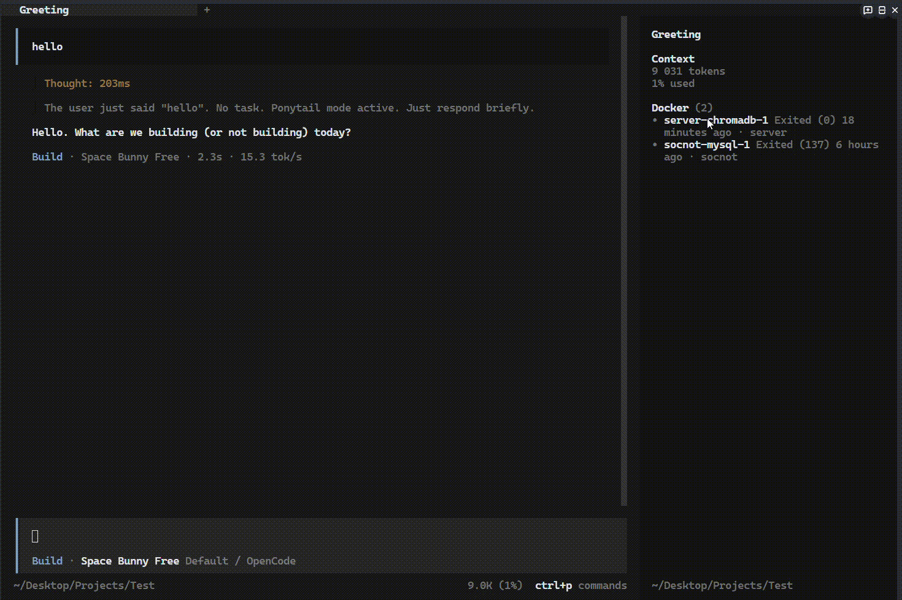
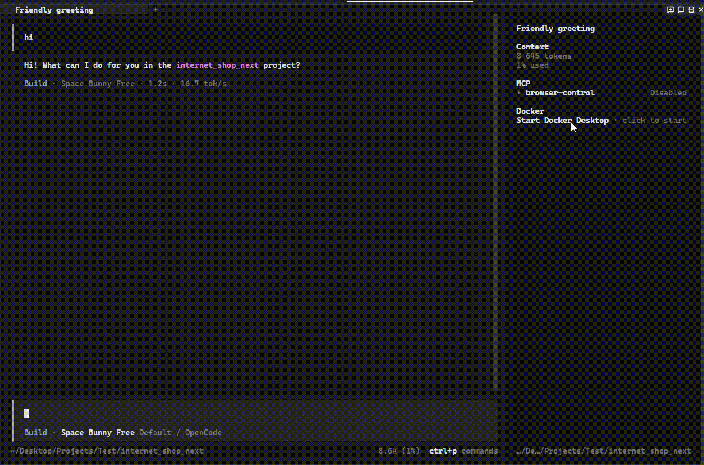
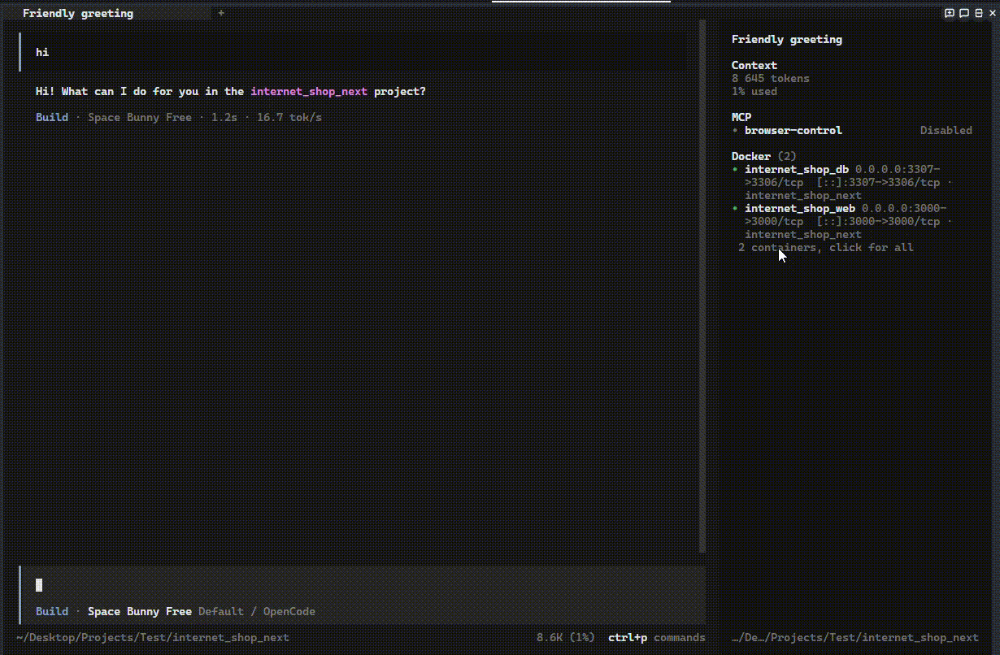

# Что умеет панель




English version of this file: [features.md](features.md)

## Запущенные и остановленные контейнеры

```text
Docker (2)
• api           0.0.0.0:8080->8080/tcp · shop
1 more, click for all
Up stack · storefront is not running here
```

Цвет точки зависит от состояния: зелёный для `running`, жёлтый для `paused` и `restarting`,
красный для `dead`, приглушённый для остальных.

Панель рисует только запущенные контейнеры, не больше пяти строк в том порядке, в котором их
отдаёт docker, поэтому список не прыгает. Остановленным контейнерам строки не
достаётся: заголовок открывает диалог со всеми контейнерами, а выбор контейнера там открывает те
же действия, что и клик по его строке. Строка под контейнерами всегда открывает полный список,
потому что в этом же списке живёт `Stop Docker Desktop`. Она читается как `1 more, click for all`, если
лимит в пять строк что-то скрывает, и как `2 containers, click for all`, если показаны все. Когда строки есть, заголовок сворачивает и разворачивает их.

Пункт `Pin` в меню контейнера оставляет контейнер видимым независимо от состояния, и на запущенном
он занимает место в бюджете из пяти строк, поэтому закрепив всё, видно всё. Закрепление хранит
хост, поэтому оно переживает перезапуск TUI и действует во всех сессиях; пункт `Unpin` в том же меню
снимает его. Закреплённые строки помечены `pinned` рядом с портами и проектом.

| Состояние панели                 | Что видно                                     |
| -------------------------------- | --------------------------------------------- |
| Docker работает, есть контейнеры | `Docker (N)` и по строке на контейнер         |
| Docker работает, контейнеров нет | `no containers`                               |
| Docker Desktop не запущен        | кликабельная строка `Start Docker Desktop`    |
| Нет CLI-плагина Docker Desktop   | кнопок нет, ничего не предлагается            |
| Docker не установлен             | `docker not installed`, кнопок нет            |
| `docker ps` не ответил вовремя   | последние известные строки с пометкой `stale` |
| Нет прав на сокет Docker         | `no permission to talk to docker`, кнопок нет |

Остановленный или отсутствующий Docker — это нормальное состояние, а не поломка плагина. Опрос,
который не достучался до docker, будь то таймаут или мёртвый демон, сохраняет последние известные
строки с пометкой `stale`. Остановленный движок так не трактуется: контейнеры действительно лежат,
поэтому строки уходят, и панель говорит об этом прямо, а не показывает то, что ничего не обслуживает.

## Действия по состоянию контейнера

| Состояние контейнера              | Какие действия предлагаются                                                                                                     |
| --------------------------------- | ------------------------------------------------------------------------------------------------------------------------------- |
| `running`, `restarting`, `paused` | `Restart`, `Stop` и `Down`, если контейнер принадлежит compose-проекту                                                          |
| `created`, `exited`, `dead`       | `Start`, `Up stack`, если в каталоге агента лежит подходящий compose-файл, и `Down`, если контейнер принадлежит compose-проекту |
| любое другое                      | ничего                                                                                                                          |

| Действие | Команда                                      |
| -------- | -------------------------------------------- |
| Start    | `docker start -- <имя>`                      |
| Up stack | `docker compose -f <файл> -p <проект> up -d` |
| Restart  | `docker restart -- <имя>`                    |
| Stop     | `docker stop -- <имя>`                       |
| Down     | `docker compose -p <проект> down`            |

Разделитель `--` обязателен: имя контейнера может начинаться с дефиса, и без разделителя docker
примет его за флаг. Точная команда показана в подписи каждого пункта, поэтому разрушительная не
выглядит сюрпризом.

Контейнер, образа которого нет на машине, сначала тянет образ, поэтому он гораздо дольше добирается
до `running`, чем обновляется панель, и она какое-то время покажет его остановленным, прежде чем он
появится. Это не поломка, повторов панель не делает.

Результат каждого действия приходит тостом, а панель обновляется сразу, не дожидаясь ничего. Пока
команда выполняется, в заголовке горит `working` и повторные клики игнорируются, так что двойной клик
не запустит две команды.

## Как приходят обновления

Панель слушает `docker events`, а не спрашивает по таймеру, поэтому контейнер появляется и исчезает
ровно тогда, когда об этом сообщает Docker. Замерено на `compose stop`: первое событие пришло через
442 мс после команды, против трёх секунд раньше.

Реакция есть только на несколько событий: `start`, `die`, `destroy`, `pause`, `unpause` и `rename`.
Панель рисует работающие контейнеры, поэтому `kill`, `stop` и `create` перерисовали бы кадр,
идентичный уже нарисованному, а всё с префиксами `exec_` и `health_` — это внутренности самого
контейнера.

Опрос не исчез, он стал страховкой. `docker ps` всё ещё запускается раз в 30 секунд и раз в 3 секунды,
пока Docker выключен, чтобы запуск Docker Desktop из трея был виден сразу. Страховка закрывает то,
что события закрыть не могут: само состояние движка, которого в потоке не бывает вовсе, и первые пару
секунд после переоткрытия потока, пока он не отдаст первое событие.

Поток заканчивается громко, а не тихо: после остановки Docker Desktop он молчит секунд тридцать, а
потом пишет `unexpected EOF` и выходит. Панель считает этот выход поводом попробовать снова, но только
после того, как `docker ps` ответил, то есть пока Docker выключен, не создаётся ни одного процесса.

## Compose-стек

`Up stack` поднимает весь compose-проект, а не один контейнер, и берёт compose-файл из каталога
агента. Такой файл — исполняемое содержимое: в нём бывают `build`, `command` и `entrypoint`,
поэтому диалог сначала показывает точную команду и подтверждения, в отличие от `down`, не
требует.

Пункт появляется только когда файл доказуемо принадлежит проекту контейнера, по которому
кликнули. Имя проекта читается так же, как это делает compose v2: явное `name:` верхнего уровня,
если оно есть, иначе имя каталога, где лежит файл. Оно должно совпасть с лейблом
`com.docker.compose.project` контейнера, а сам контейнер не должен быть уже запущен. Во всех
остальных случаях пункта просто нет, потому что не тот стек хуже, чем отсутствие кнопки.

Стек, у которого нет ни одного контейнера, — обычное состояние того, что никогда не запускали, и
для него сделана отдельная входная точка. Когда в каталоге агента лежит compose-файл и на машине
нет ни одного контейнера с таким лейблом проекта, под строками появляется строка:

```text
Up stack · storefront is not running here
```

Клик по ней один раз спрашивает, показывая точную команду до запуска: compose-файл это
исполняемое содержимое, а у стека нет контейнера, которым можно назвать действие. Как только
появится хоть один контейнер этого проекта, строка исчезает: дальше входом служит `Up stack` у
самого контейнера. Один Dockerfile без compose-файла ничего не предлагает: запускать нечего без
имени образа, и панель догадывалась бы.

Проект передаётся дважды, как `-f <файл>` и `-p <проект>`. Имя внутри файла может быть
шаблонным или перебитым окружением, и `-p` гарантирует, что поднимется тот самый проект, который
панель уже показывает, а не его вторая копия.

Поскольку `-p` заменяет собственный вывод compose, панель нормализует имя каталога так же, как
compose: приводит к нижнему регистру, убирает всё, что не буква, не цифра, не дефис и не подчёркивание,
и убирает то, что осталось перед первой буквой. Каталог `CarManufacturersMVC` поднимается как
`carmanufacturersmvc` — это ровно то имя, которое compose производит сам. Имя, из которого после
нормализации ничего не остаётся, и строка `name:`, которую compose отверг бы, кнопки не получают
вовсе, вместо команды, которая может только провалиться.

Кандидаты проверяются в том же порядке, что и у compose: `compose.yaml`, `compose.yml`,
`docker-compose.yaml`, `docker-compose.yml`. Первый существующий файл побеждает, даже если он
объявляет другой проект, потому что именно его использовал бы сам compose: если продолжить поиск,
кнопка предложила бы стек, который CLI игнорирует.

`Down` выполняет `docker compose down` для compose-проекта из лейблов контейнера: останавливает все
контейнеры проекта и удаляет их сети. Тома остаются, о чём и говорит диалог подтверждения.
Контейнеру без compose-проекта пункт не предлагается, и `buildArgs` его тоже отклоняет.

## Логи

Пункт `Logs` в том же меню перезаписывает содержимое окна логами контейнера, то есть логи и действия
делят одно окно. Закрывается через `esc` или кликом по нижней строке.

Просмотр — это `docker logs --timestamps --tail 200 -- <имя>`, обновление раз в две секунды, пока
окно открыто. Docker пишет потоки контейнера вперемешку, поэтому буферы разбираются отдельно и
снова сливаются по времени: без этого лог читался бы сначала целиком из stdout. ANSI-последовательности
и одиночные `CR` вырезаются, иначе терминал выполнил бы их как управляющие коды. Окно фиксированной
высоты в пятнадцать строк прокручивается колесом мыши.

## Docker Desktop

Панель умеет включать и выключать сам Docker Desktop. Обе команды идут через `docker desktop`,
CLI-плагин, который поставляется вместе с Docker Desktop.

| Действие               | Где живёт                                          | Команда                |
| ---------------------- | -------------------------------------------------- | ---------------------- |
| `Start Docker Desktop` | строка в сайдбаре, только когда Desktop остановлен | `docker desktop start` |
| `Stop Docker Desktop`  | последняя позиция списка контейнеров               | `docker desktop stop`  |



`Start` спрашивает первый, так же как `Stop`. Холодный старт поднимает виртуальную машину и начинает
есть память, поэтому промах по кнопке не бесплатен. Панель держит `working` всё время перехода, а не
гасит индикатор сразу после возврата команды.

`Stop` спрашивает всегда, и в подтверждении перечисляет все запущенные контейнеры, которые панель
видит, потому что `docker desktop stop` гасит движок и все контейнеры встают вместе с ним, во всех
проектах, а не только в том, по которому кликнули. Как только команда начинается, строки и счётчик в
заголовке исчезают и остаётся одно `Docker working`, чтобы сайдбар никогда не показывал контейнеры,
которые уже уходят.



Список контейнеров остаётся доступным, когда Docker выключен и контейнеров нет вообще, потому что
именно тогда `Stop` и нужен. Ранний выход на пустом списке раньше показывал тост
`no containers`, и он спрятал бы единственный способ включить движок обратно.

Открытое окно логов в момент остановки сохраняет последние строки и перестаёт опрашивать, потому
что любой вызов `docker logs` к остановленному движку всё равно падает. Открыть контейнер из
списка при остановленном Desktop предлагает только `Start Docker Desktop`, и не предлагает ничего,
если CLI-плагина нет или состояние движка прочитать не удалось.

О остановленном движке панель узнаёт из опроса контейнеров, а не из отдельной пробы, потому что
`docker ps` говорит об этом сам: канал `dockerDesktopLinuxEngine` принадлежит бэкенду Desktop, и
когда его нет, `docker ps` падает с `open //./pipe/dockerDesktopLinuxEngine: The system cannot find
the file specified` примерно за четверть секунды. `docker desktop status` на признание того же
факта тратит четыре секунды, потому что CLI-плагин перед этим ждёт тот же самый канал.

Проба остаётся для случаев, которые опрос опознать не может. `permission denied` на канале
означает закрытый сокет, а не остановленный движок, и `docker not installed` означает отсутствие CLI
вовсе, поэтому такие случаи идут в `docker desktop status`. Команда ничего не сообщает про
остановленный Docker: она заканчивается кодом 1 и пишет в stderr `Could not retrieve status. Is
Docker Desktop running?`, а в stdout `You can start Docker Desktop by running 'docker desktop
start'.`. Панель читает код возврата вместе с этой формулировкой, а всё, что не смогла опознать,
считает `unknown` и ничего не предлагает. На неопознанном состоянии кнопок нет. Версию плагина панель
не сравнивает никогда, потому что CLI-плагин обновляется отдельно от приложения.

## Ограничения

- Сайдбар рисует только контейнеры в состоянии `running`. `paused` и `restarting` строки не
  получают, хотя docker считает их живыми, — чтобы увидеть такой контейнер, закрепи его.
- OpenCode 2 находится в бета-фазе, поэтому имена слотов и токены темы могут измениться.
- Обходное решение с перерисовкой сбрасывает свёрнутое состояние и закрывает открытое окно логов,
  когда список контейнеров действительно меняется.
- Сайдбар реагирует на события контейнеров, а не на скачивание образов. Контейнер, который тянет
  образ впервые, не появится в списке, пока не дойдёт до `running`.
- Строк не больше пяти, и пять — константа, а не опция: на машине с тридцатью контейнерами панель
  покажет пять, а остальные останутся в диалоге. Единственный способ вывести шестой — закрепить
  его.
- Сам сайдбар не прокручивается, поэтому контейнеры за пределами пяти живут в диалоге, а не в
  панели.
- Нет exec, работы с томами и образами, истории перезапусков. `Down` предлагается у контейнера, но
  действует на весь compose-проект. Окно логов — фиксированное окно поверх последних 200 строк,
  истории глубже нет.
- `Up stack` поднимает только стек, чей compose-файл лежит в каталоге агента. Проект, созданный в
  другом месте, всё равно можно снести через `Down`, но поднять его можно только `Start` на одном
  контейнере.
- `Up stack` может остаться скрытым, когда compose-файл объявляет проект в форме, которую панель
  прочитать не может: например, `name:` с отступом или в кавычках. Это отказ, а не неверный
  запуск.
- Действия только мышью; слой клавиш плагин не регистрирует.
- Управление Docker Desktop работает только на Windows и требует CLI-плагина `docker desktop`.
  Без него панель ничего не предлагает. Запасного пути через исполняемый файл приложения нет: его
  нечем проверить на машине, где плагин на месте.
- Между стартом Docker Desktop и созданием канала бэкендом есть короткое окно, в котором панель
  предлагает `Start Docker Desktop` при уже поднимающемся движке. Нажатие безвредно, команда
  ничего не делает и сразу возвращается.
- `docker desktop status` отвечает до четырёх с половиной секунд, когда Docker остановлен, потому
  что плагин ждёт канал, который не отвечает. Проба панели даёт девять секунд, чтобы доказанный
  `stopped` не обрывался и не превращался в `unknown`.
- Пакет на npm уходит предкомпилированным ESM, а не исходниками TypeScript. OpenCode
  трансформирует исходники плагинов трансформацией Solid из OpenTUI, которая пропускает любой путь
  внутри `node_modules`, поэтому плагин, установленный с npm, обязан приходить готовым JavaScript:
  иначе Bun соберёт его JSX против React. Не отдавай `.tsx`.
- `solid-js`, пакеты OpenTUI и SDK OpenCode объявлены опциональными пирами. npm поэтому никогда не
  кладёт рядом с плагином вторую копию их, на которую хост переписывает свои же импорты. Жёсткие
  зависимости принесут на диск второй рантайм Solid и сломают отрисовку.
